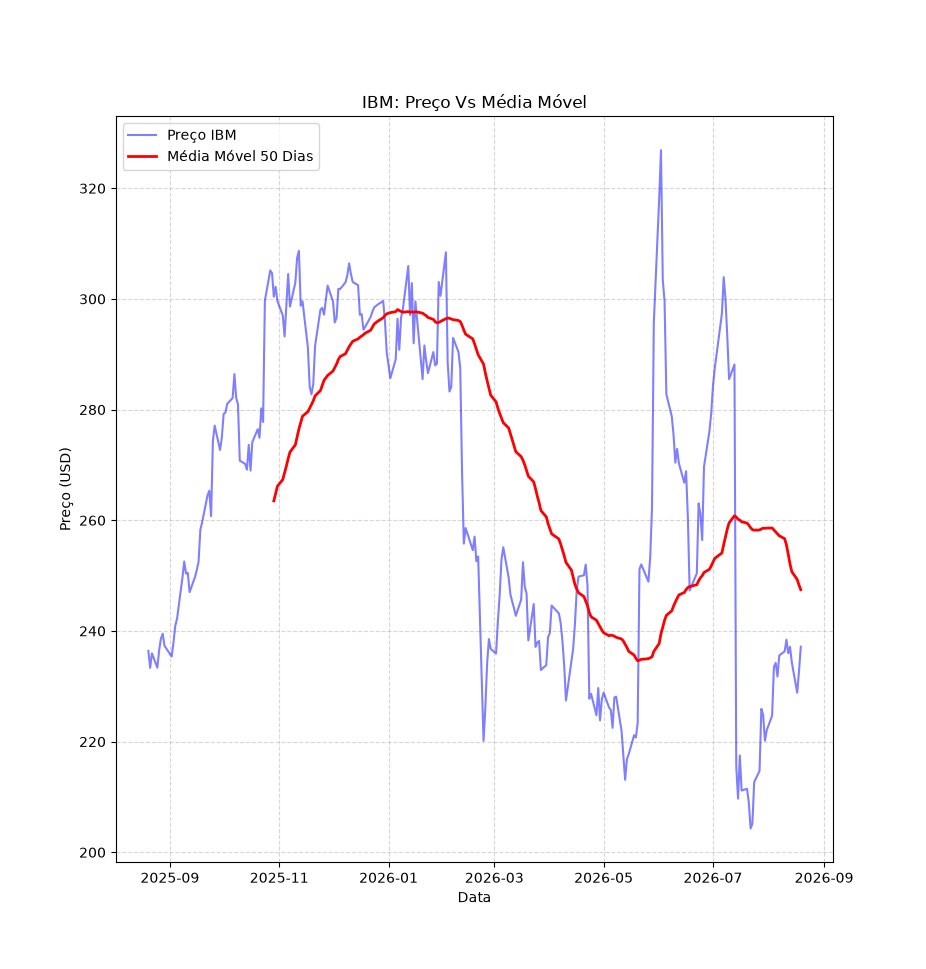

# Risco de Portfólio: IBM vs Microsoft

## Stack Utilizada

- Python 3.12
- Pandas & NumPy (Tratamento de séries temporais e matemática financeira)
- yfinance (Extração de dados via API)
- Matplotlib (Visualização de dados)

## Sobre a Análise

Extração dos dados de fechamento das ações da IBM e da Microsoft a partir do Yahoo Finance.

A partir do cálculo do retorno anualizado e da volatilidade, podemos construir o índice de Sharpe, que indica quanto retorno foi obtido para cada unidade de risco assumida, em comparação com a taxa livre de risco. Neste caso hipotético, essa taxa é representada pelo rendimento dos títulos do Tesouro dos Estados Unidos, considerados um investimento de baixo risco.

Também é calculado o Maximum Drawdown, que mede a maior queda percentual do preço em relação ao seu pico anterior no período. Trata-se de um indicador do grau de severidade da pior perda enfrentada por quem estava posicionado no ativo.

## Indicadores

- Retorno Acumulado:
- Volatilidade Anualizada:
- Sharpe:
- Maximum Drawdowns: 

| Métrica                 | IBM     | MSFT    |
| -------------------------| ---------| ---------|
| Volatilidade Anualizada | 48.41%  | 32.30%  |
| Índice de Sharpe        | 0.178   | -0.076  |
| Maximum Drawdown        | -37.50% | -34.50% |

## Grafico de Retorno Comparado com a Media Móvel

Visualização do preço de fechamento da IBM comparado à sua média móvel de 50 dias, permitindo identificar tendências de curto/médio prazo.

## Conclusão

